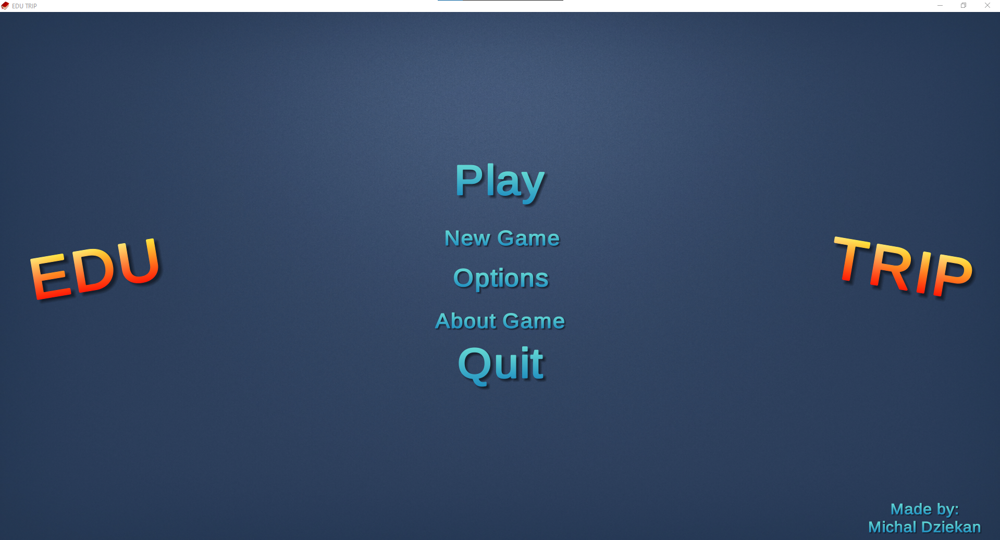
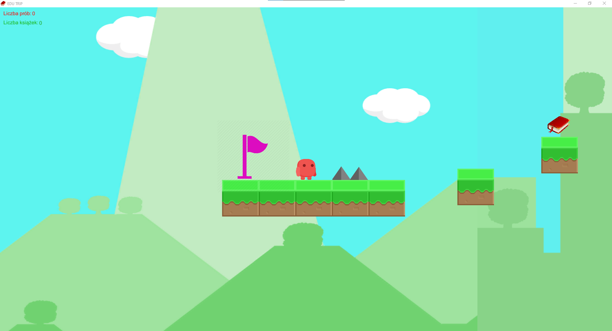
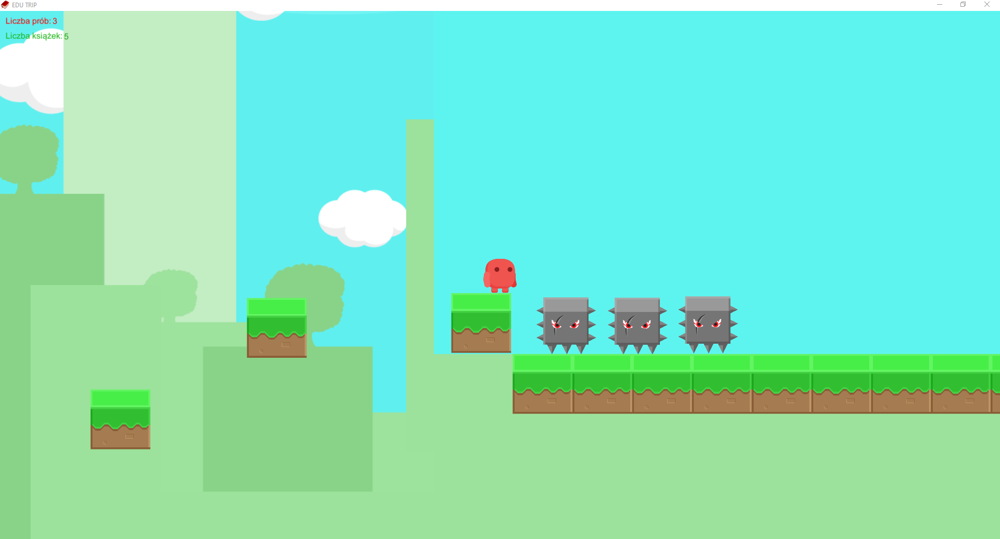
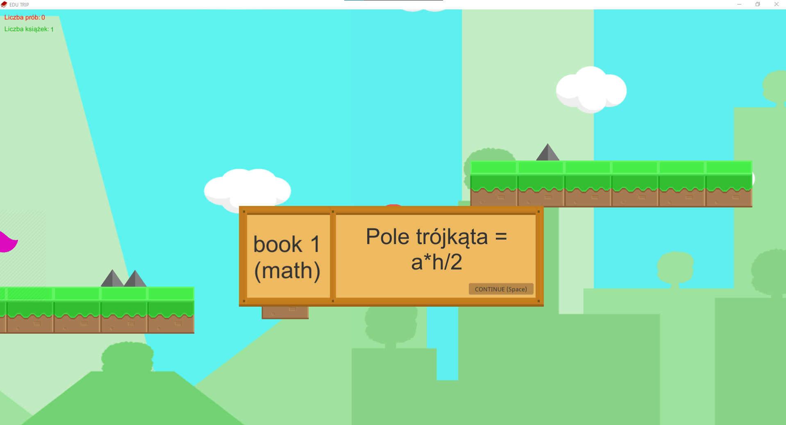
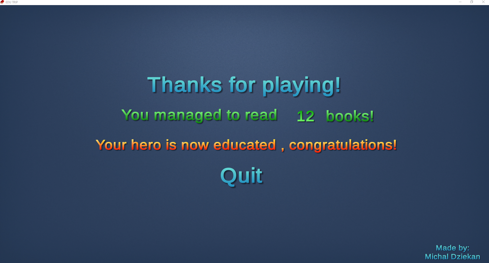

# EDU-TRIP
 Gra platformowa 2D

EDU TRIP jest grą platformową 2D stworzoną za pomocą silnika Unity w języku C#.
Celem gry jest dojście postacią do mety, po drodze zbierając jak najwięcej książek.
W grze spotkamy różne przeszkody oraz kilka typów przeciwników.

Main Menu aplikacji:

Gra:

Każda różowa flaga oznacza checkpoint, w którym się odrodzimy w przypadku niepowodzenia.
W lewym górnym rogu ekranu umieszczone są liczniki naszych prób oraz zebranych książek.

Przeciwnicy:

Wrogowie poruszają się co utrudnia pokonanie ich. Aby zlikwidowac przeciwnika należy skoczyć mu na "głowę".

Książki:

Po podniesieniu książki wyświetlona zostaje edukacyjna ciekawostka.

Ekran końcowy:

